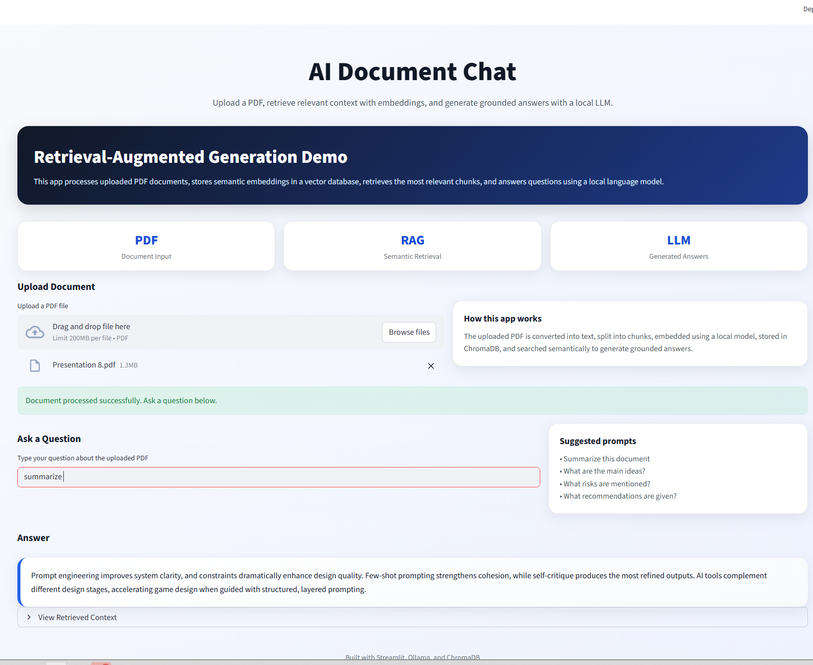

# AI Document Chat (RAG)

A Retrieval-Augmented Generation system for uploading documents and having a streamed, multi-turn conversation about their contents. Runs fully offline with Ollama or in the cloud with Groq + Cohere — deploy free to [Render](https://render.com).

**Live demo:** https://rag-document-search-qe6o.onrender.com



---

## Features

- Upload PDF or DOCX documents (up to 50MB, magic-byte validated)
- Sentence-aware text chunking for better retrieval quality
- Embeddings via **Cohere** API (cloud) or `nomic-embed-text` (Ollama, local)
- Persistent vector store with ChromaDB (survives restarts)
- Multi-document support — each document stored independently, deletable from sidebar
- Streaming LLM answers (token-by-token) via **Groq** (cloud) or `gemma3:4b` (Ollama, local)
- Multi-turn chat with conversation history passed to the LLM
- Similarity scores shown for each retrieved context chunk
- Concurrent embedding (4 workers) with live progress bar
- Query embedding cache — same query never re-embedded
- Download any answer as `answer.txt`
- Optional password auth gate and per-session rate limiting
- CLI pipeline for batch-loading a folder of documents

---

## Tech Stack

- Python 3.12+
- [Streamlit](https://streamlit.io)
- [ChromaDB](https://www.trychroma.com) — persistent vector database
- [Groq](https://groq.com) — cloud LLM inference (free tier available)
- [Cohere](https://cohere.com) — cloud embeddings (free tier available)
- [Ollama](https://ollama.com) — local LLM and embedding inference (offline alternative)
- [PyPDF](https://pypdf.readthedocs.io) — PDF text extraction
- [python-docx](https://python-docx.readthedocs.io) — DOCX text extraction

---

## Setup

### 1. Install Ollama and pull the required models

```bash
ollama pull gemma3:4b
ollama pull nomic-embed-text
```

### 2. Create a virtual environment and install dependencies

```bash
python3 -m venv venv
source venv/bin/activate
pip install -r requirements.txt
```

### 3. Configure environment variables

```bash
cp .env.example .env
# Edit .env as needed — defaults work out of the box
```

---

## Run

### Web UI

```bash
streamlit run streamlit_app.py
```

### CLI (batch-loads `data/docs/` folder)

```bash
python app.py
```

The CLI supports interactive multi-turn Q&A with streaming output. Place `.pdf`, `.docx`, or `.txt` files in `data/docs/` before running.

### Tests

```bash
python -m pytest tests/ -v
```

### Docker

```bash
# Pull required Ollama models first (one-time setup inside the ollama container)
docker compose up ollama -d
docker compose exec ollama ollama pull gemma3:4b
docker compose exec ollama ollama pull nomic-embed-text

# Start everything
docker compose up
```

The app will be available at `http://localhost:8501`. ChromaDB and Ollama model data are persisted in named Docker volumes.

---

## Deploy to Render (free, cloud)

This project ships with a `render.yaml` for one-click deployment on Render's free tier using **Groq** (LLM) and **Cohere** (embeddings) — no Ollama required.

### 1. Get API keys

- **Groq** — sign up at [console.groq.com](https://console.groq.com), create an API key (free tier supports `llama-3.1-8b-instant`)
- **Cohere** — sign up at [dashboard.cohere.com](https://dashboard.cohere.com), create an API key (free trial includes 1000 embed calls/month)

### 2. Fork and connect to Render

1. Fork this repo to your GitHub account
2. Go to [dashboard.render.com](https://dashboard.render.com) → **New → Web Service**
3. Connect your GitHub account and select the forked repo
4. Render will auto-detect `render.yaml` — click **Apply**

### 3. Set secret environment variables

In the Render dashboard for your service → **Environment**:

| Variable | Value |
|---|---|
| `GROQ_API_KEY` | your Groq API key |
| `COHERE_API_KEY` | your Cohere API key |
| `APP_PASSWORD` | _(optional)_ set to enable password auth |

Click **Save Changes** — Render will redeploy automatically.

> **Note:** The free tier uses ephemeral storage (`/tmp/chroma_db`). Uploaded documents will be lost on restart. Upgrade to a paid plan or attach a persistent disk to retain them.

---

## Configuration

All settings are in `.env`. Key options:

| Variable | Default | Description |
|---|---|---|
| `LLM_MODEL` | `gemma3:4b` | Ollama model for answer generation |
| `EMBED_MODEL` | `nomic-embed-text` | Ollama model for embeddings |
| `CHUNK_SIZE` | `500` | Max characters per chunk |
| `CHUNK_OVERLAP` | `100` | Overlap between adjacent chunks |
| `MAX_FILE_SIZE_MB` | `50` | Upload size limit |
| `MAX_QUERY_LENGTH` | `500` | Max query characters |
| `RATE_LIMIT_PER_MINUTE` | `20` | Max queries per session per minute |
| `APP_PASSWORD` | _(empty)_ | Set to enable password auth gate |
| `MAX_HISTORY_TURNS` | `10` | Max conversation turns kept in LLM context |
| `LOG_LEVEL` | `INFO` | Logging verbosity (`DEBUG`, `INFO`, `WARNING`) |
| `CHROMA_PATH` | `./chroma_db` | Where ChromaDB persists data |
| `GROQ_API_KEY` | _(empty)_ | Groq API key — activates Groq LLM backend |
| `GROQ_MODEL` | `llama-3.1-8b-instant` | Groq model name |
| `COHERE_API_KEY` | _(empty)_ | Cohere API key — activates Cohere embedding backend |
